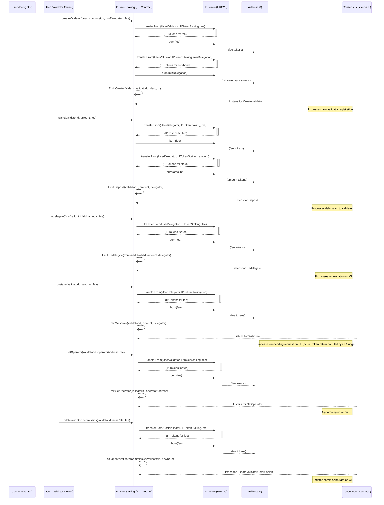

# IPTokenStaking.sol - Detailed Analysis

## 1. Purpose and Function

The `IPTokenStaking.sol` contract is a crucial component of the protocol, designed to manage staking operations for the native IP token on the Execution Layer (EL). It serves as an interface or "bridge" to the Consensus Layer (CL), where the actual validation and staking rewards logic are presumed to reside. The primary purpose of this contract is to allow users (delegators and potential validators) to participate in the network's security and consensus by staking their IP tokens.

**Key Characteristics and Functions:**

*   **Execution Layer Staking Interface**: Users interact with this EL contract to perform staking actions such as creating a validator profile, delegating stake to a validator, redelegating stake between validators, and initiating unbonding of their stake.
*   **Token Burning Mechanism**: A distinctive feature of this contract is that when IP tokens are staked (either as an initial self-bond for a new validator or as a delegation to an existing one), these tokens are **burned** on the EL. This means the tokens are sent to a null address (e.g., `address(0)`), effectively removing them from the EL supply. Similarly, fees associated with staking operations are also burned.
*   **Asynchronous Cross-Layer Operations**: Actions performed on `IPTokenStaking.sol` are asynchronous with respect to the Consensus Layer.
    *   When a user calls a function like `stake()` or `createValidator()`, the contract validates the request, burns the required IP tokens (both the stake amount and any associated fees) on the EL, and then emits an event (e.g., `Deposit`, `CreateValidator`).
    *   An external component, often part of the CL or a bridge oracle system, listens for these events. Upon detecting an event, this component is responsible for verifying it and then reflecting the corresponding staking operation (e.g., increasing a validator's stake, registering a new validator) on the Consensus Layer.
*   **Signaling Intent for CL Actions**: Operations like `unstake()` or `redelegate()` also follow this pattern. The EL contract emits an event signaling the user's intent. The CL then processes this intent, which might involve an unbonding period (for `unstake`) or atomically moving stake (for `redelegate`) according to the CL's specific rules. The actual crediting of tokens back to a user after unstaking would likely be managed by a separate bridge mechanism, triggered by the CL completing the unbonding process, and is outside the direct token flow of this contract (which primarily handles burning for staking).
*   **Validator Management**: The contract allows for validator-specific operations such as setting an operator address (who can manage the validator on behalf of the owner) and updating the validator's commission rate. These actions also involve burning a fee and emitting an event to inform the CL.

In summary, `IPTokenStaking.sol` acts as a one-way street for IP tokens going into the staking system (via burning on EL) and as a signaling mechanism for staking-related commands that are ultimately executed and managed by the Consensus Layer.

## 2. Mermaid Diagram of Functionalities and Interactions

## 3. Interactions Explained

The diagram illustrates the following key interactions:

*   **User Actions**: Users (Delegators or those intending to become Validators) initiate all staking operations by calling functions on the `IPTokenStaking` contract deployed on the Execution Layer.
*   **Token Transfer and Burning**:
    *   For operations that require IP tokens (staking amounts or fees), the `IPTokenStaking` contract first facilitates the transfer of these tokens from the user's account to itself, using the ERC20 `transferFrom` pattern (assuming users have pre-approved the staking contract).
    *   Immediately after receiving the tokens, the `IPTokenStaking` contract burns them by transferring them to `address(0)`. This applies to both the principal stake amount and any transaction fees defined by the staking contract.
*   **Event Emission**: After processing an action (including token burning), the `IPTokenStaking` contract emits a specific event (e.g., `CreateValidator`, `Deposit`, `Redelegate`, `Withdraw`, `SetOperator`, `UpdateValidatorCommission`). These events contain the details of the operation.
*   **Consensus Layer Processing**: An off-chain or cross-chain component representing the Consensus Layer actively listens for these events. Upon receiving an event, the Consensus Layer interprets the data and updates its own state accordingly. For example:
    *   A `Deposit` event leads to the CL increasing the stake delegated to the specified validator.
    *   A `CreateValidator` event leads to the CL registering a new validator entity.
    *   A `Withdraw` event signals the CL to start an unbonding process for the user's stake. The actual return of tokens to the user on the EL post-unbonding is typically handled by a separate bridge mechanism synchronized with the CL, not directly by the `IPTokenStaking` contract's burn-focused flow.
*   **Fee Handling**: Most operations involve a fee, which is also paid in IP tokens and subsequently burned by the `IPTokenStaking` contract. This acts as a cost for utilizing the staking service and contributes to the deflationary aspect of the IP token.

This asynchronous, event-driven architecture allows the Execution Layer contract to remain relatively simple while delegating complex staking logic, validator management, and reward distribution to the specialized Consensus Layer. The burning mechanism on the EL serves as a clear commitment of tokens to the staking process within the CL.
