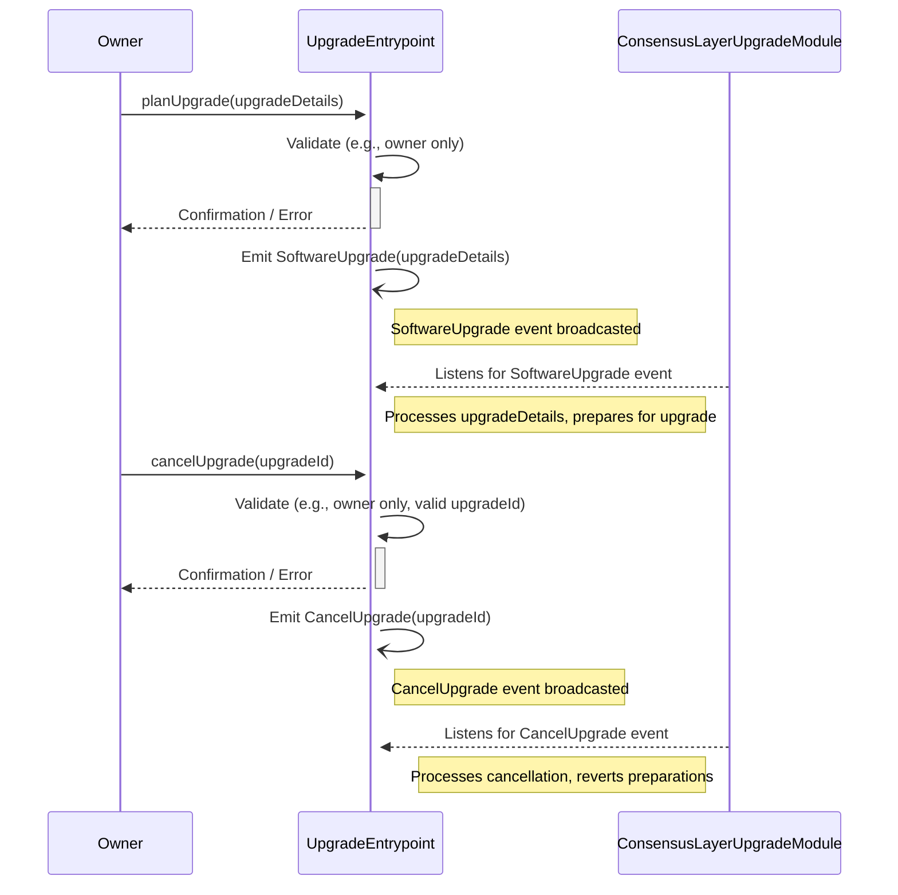

# UpgradeEntrypoint.sol - Detailed Analysis

## 1. Purpose and Function

The `UpgradeEntrypoint.sol` contract is a critical component of the protocol, responsible for managing and orchestrating software upgrades. Its primary purpose is to provide a secure and controlled mechanism for introducing new versions of smart contracts or updating protocol parameters.

**Key Functions:**

*   **Centralized Control**: It acts as a central point of authority for the upgrade process, typically controlled by a designated "Owner" or a multi-signature governance mechanism. This prevents unauthorized modifications to the protocol.
*   **Upgrade Planning**: The contract allows the Owner to schedule or "plan" an upgrade. This likely involves specifying the details of the new software version, such as the code address for a new implementation contract or new configuration parameters. This planned upgrade is often associated with a specific identifier or version number.
*   **Upgrade Execution (Off-Chain)**: It is important to note that this specific `UpgradeEntrypoint.sol` contract *does not* include an on-chain function to execute the planned upgrade. Instead of directly modifying state or contract pointers for execution, its role is to signal that an upgrade should occur. The actual execution is handled by an external, off-chain component, referred to in the contract's comments as a 'Consensus Layer Upgrade Module' or 'x/upgrade module'. This module listens for events emitted by this contract.
*   **Upgrade Cancellation**: It provides a mechanism for the Owner to cancel a previously planned upgrade, perhaps if a vulnerability is found in the new version before it goes live, or if governance decides against the upgrade.
*   **Event Emission for Off-Chain Coordination**: The contract emits events (`SoftwareUpgrade`, `CancelUpgrade`) when upgrades are planned or canceled. These events are crucial for signaling the aforementioned 'Consensus Layer Upgrade Module'. This external module is responsible for listening to these events and then taking the necessary actions at the consensus layer or other off-chain systems to enact the software change or cancel it. This might involve updating node software, coordinating validators, or changing consensus rules that are aware of specific contract versions.

In essence, `UpgradeEntrypoint.sol` decouples the on-chain declaration and scheduling of upgrades from their actual execution, which is delegated to an off-chain consensus-aware mechanism. This provides transparency and allows participants in the broader system to react accordingly.

## 2. Mermaid Diagram of Functionality and Interactions

## 3. Interactions Explained

*   **Owner Initiates**: The "Owner" (which could be a multi-sig wallet or a DAO) initiates upgrade-related actions.
    *   To plan an upgrade, the Owner calls the `planUpgrade` function on the `UpgradeEntrypoint` contract, providing necessary details about the upgrade (e.g., new contract address, version identifier, activation time).
    *   To cancel an upgrade, the Owner calls the `cancelUpgrade` function, typically referencing the specific upgrade to be canceled.
*   **UpgradeEntrypoint Contract**:
    *   Validates that the caller of `planUpgrade` and `cancelUpgrade` is authorized (i.e., is the Owner).
    *   Upon successful validation of `planUpgrade`, it stores the upgrade plan internally (not explicitly shown in diagram but implied) and emits a `SoftwareUpgrade` event. This event contains the details of the planned upgrade.
    *   Upon successful validation of `cancelUpgrade`, it updates its internal state to reflect the cancellation and emits a `CancelUpgrade` event.
*   **Consensus Layer Upgrade Module (External)**:
    *   This is an external entity, likely part of the node software or consensus mechanism of the blockchain where these contracts are deployed.
    *   It actively listens for `SoftwareUpgrade` and `CancelUpgrade` events emitted by the `UpgradeEntrypoint` contract.
    *   When a `SoftwareUpgrade` event is detected, this module would interpret the `upgradeDetails` and begin any necessary preparations at the consensus level. This could involve downloading new client software, preparing for a hard fork or a coordinated state change that aligns with the application-layer upgrade.
    *   When a `CancelUpgrade` event is detected, this module would halt or revert any preparations it was making for the specified upgrade.

This interaction model ensures that application-layer upgrades managed by `UpgradeEntrypoint.sol` can be safely and effectively coordinated with potential changes required at the underlying consensus layer of the blockchain.
