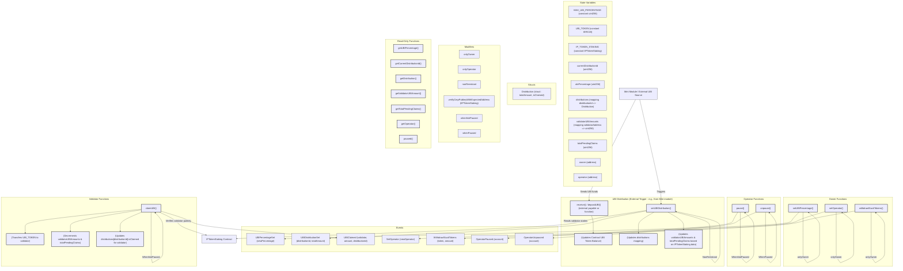

```mermaid
graph TD
    subgraph "State Variables"
        MAX_UBI_PERCENTAGE["MAX_UBI_PERCENTAGE (constant uint256)"]
        UBI_TOKEN["UBI_TOKEN (constant IERC20)"]
        IP_TOKEN_STAKING["IP_TOKEN_STAKING (constant IIPTokenStaking)"]
        currentDistributionId["currentDistributionId (uint256)"]
        ubiPercentage["ubiPercentage (uint256)"]
        distributions["distributions (mapping distributionId => Distribution)"]
        validatorUBIAmounts["validatorUBIAmounts (mapping validatorAddress => uint256)"]
        totalPendingClaims["totalPendingClaims (uint256)"]
        owner["owner (address)"]
        operator["operator (address)"]
    end

    subgraph "Structs"
        Distribution["Distribution (struct: totalAmount, isClaimed)"]
    end

    subgraph "Events"
        UBIPercentageSet["UBIPercentageSet (newPercentage)"]
        UBIDistributionSet["UBIDistributionSet (distributionId, totalAmount)"]
        UBIClaimed["UBIClaimed (validator, amount, distributionId)"]
        SetOperatorEvent["SetOperator (newOperator)"]
        WithdrawStuckTokensEvent["WithdrawStuckTokens (token, amount)"]
        OperatorPausedEvent["OperatorPaused (account)"]
        OperatorUnpausedEvent["OperatorUnpaused (account)"]
    end

    subgraph "Modifiers"
        OnlyOwner["onlyOwner"]
        OnlyOperator["onlyOperator"]
        NonReentrant["nonReentrant"]
        VerifyCmpPubkey["verifyCmpPubkeyWithExpectedAddress (IIPTokenStaking)"]
        WhenNotPaused["whenNotPaused"]
        WhenPaused["whenPaused"]
    end

    subgraph "Owner Functions"
        SetUBIPercentage["setUBIPercentage()"]
        SetOperator["setOperator()"]
        WithdrawStuckTokens["withdrawStuckTokens()"]

        SetUBIPercentage -- onlyOwner --> SetUBIPercentage
        SetUBIPercentage --> UBIPercentageSet

        SetOperator -- onlyOwner --> SetOperator
        SetOperator --> SetOperatorEvent

        WithdrawStuckTokens -- onlyOwner --> WithdrawStuckTokens
        WithdrawStuckTokens --> WithdrawStuckTokensEvent
    end

    subgraph "Operator Functions"
        Pause["pause()"]
        Unpause["unpause()"]

        Pause -- OnlyOperator --> Pause
        Pause -- WhenNotPaused --> Pause
        Pause --> OperatorPausedEvent

        Unpause -- OnlyOperator --> Unpause
        Unpause -- WhenPaused --> Unpause
        Unpause --> OperatorUnpausedEvent
    end

    subgraph "UBI Distribution (External Trigger - e.g., from Mint module)"
        ReceiveUBIFunds["receive() / depositUBI() (external payable or function)"]
        SetUBIDistribution["setUBIDistribution()"]

        ReceiveUBIFunds --> UpdateTotalPoolBalance["(Updates Contract UBI Token Balance)"]

        SetUBIDistribution -- "Permissioned (e.g., only Mint module or Owner)" --> SetUBIDistribution
        SetUBIDistribution -- NonReentrant --> SetUBIDistribution
        SetUBIDistribution --> UBIDistributionSet
        SetUBIDistribution --> UpdateDistributionStruct["(Updates distributions mapping)"]
        SetUBIDistribution --> UpdateValidatorUBIAmounts["(Updates validatorUBIAmounts & totalPendingClaims based on IPTokenStaking data)"]
    end

    subgraph "Validator Functions"
        ClaimUBI["claimUBI()"]

        ClaimUBI -- NonReentrant --> ClaimUBI
        ClaimUBI -- VerifyCmpPubkey --> ClaimUBI
        ClaimUBI -- WhenNotPaused --> ClaimUBI
        ClaimUBI --> UBIClaimed
        ClaimUBI --> TransferUBITokens["(Transfers UBI_TOKEN to validator)"]
        ClaimUBI --> UpdatePendingClaims["(Decrements validatorUBIAmounts & totalPendingClaims)"]
        ClaimUBI --> MarkDistributionClaimed["(Updates distributions[distributionId].isClaimed for validator)"]
    end

    subgraph "Read-Only Functions"
        GetUBIPercentage["getUBIPercentage()"]
        GetCurrentDistributionId["getCurrentDistributionId()"]
        GetDistribution["getDistribution()"]
        GetValidatorUBIAmount["getValidatorUBIAmount()"]
        GetTotalPendingClaims["getTotalPendingClaims()"]
        GetOperator["getOperator()"]
        Paused["paused()"]
    end

    %% External Systems
    MintModule["Mint Module / External UBI Source"]
    IPTokenStakingContract["IPTokenStaking Contract"]

    MintModule -- "Sends UBI funds" --> ReceiveUBIFunds
    MintModule -- "Triggers" --> SetUBIDistribution
    SetUBIDistribution -- "Reads validator stakes" --> IPTokenStakingContract
    ClaimUBI -- "Verifies validator pubkey" --> IPTokenStakingContract


    %% Styling
    classDef stateVar fill:#lightgrey,stroke:#333,stroke-width:1px;
    classDef event fill:#lightblue,stroke:#333,stroke-width:1px;
    classDef modifier fill:#lightgreen,stroke:#333,stroke-width:1px;
    classDef func fill:#orange,stroke:#333,stroke-width:2px;
    classDef external fill:#pink,stroke:#333,stroke-width:1px;
    classDef struct fill:#yellow,stroke:#333,stroke-width:1px;

    class MAX_UBI_PERCENTAGE,UBI_TOKEN,IP_TOKEN_STAKING,currentDistributionId,ubiPercentage,distributions,validatorUBIAmounts,totalPendingClaims,owner,operator stateVar;
    class Distribution struct;
    class UBIPercentageSet,UBIDistributionSet,UBIClaimed,SetOperatorEvent,WithdrawStuckTokensEvent,OperatorPausedEvent,OperatorUnpausedEvent event;
    class OnlyOwner,OnlyOperator,NonReentrant,VerifyCmpPubkey,WhenNotPaused,WhenPaused modifier;
    class SetUBIPercentage,SetOperator,WithdrawStuckTokens,Pause,Unpause,ReceiveUBIFunds,SetUBIDistribution,ClaimUBI,GetUBIPercentage,GetCurrentDistributionId,GetDistribution,GetValidatorUBIAmount,GetTotalPendingClaims,GetOperator,Paused func;
    class MintModule,IPTokenStakingContract external;
    class UpdateTotalPoolBalance,UpdateDistributionStruct,UpdateValidatorUBIAmounts,TransferUBITokens,UpdatePendingClaims,MarkDistributionClaimed func;
```
