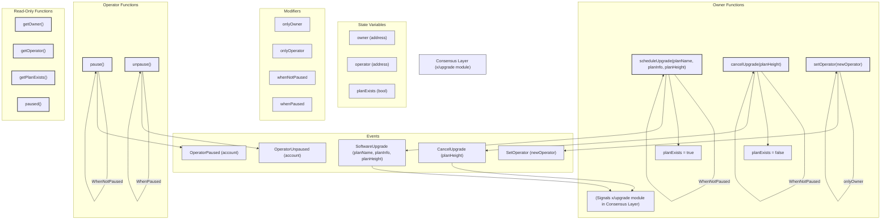

```mermaid
graph TD
    subgraph "State Variables"
        Owner["owner (address)"]
        Operator["operator (address)"]
        PlanExists["planExists (bool)"]
    end

    subgraph "Events"
        SoftwareUpgradeEvent["SoftwareUpgrade (planName, planInfo, planHeight)"]
        CancelUpgradeEvent["CancelUpgrade (planHeight)"]
        SetOperatorEvent["SetOperator (newOperator)"]
        OperatorPausedEvent["OperatorPaused (account)"]
        OperatorUnpausedEvent["OperatorUnpaused (account)"]
    end

    subgraph "Modifiers"
        OnlyOwner["onlyOwner"]
        OnlyOperator["onlyOperator"]
        WhenNotPaused["whenNotPaused"]
        WhenPaused["whenPaused"]
    end

    subgraph "Owner Functions"
        ScheduleUpgrade["scheduleUpgrade(planName, planInfo, planHeight)"]
        CancelUpgrade["cancelUpgrade(planHeight)"]
        SetOperator["setOperator(newOperator)"]

        ScheduleUpgrade -- onlyOwner --> ScheduleUpgrade
        ScheduleUpgrade -- WhenNotPaused --> ScheduleUpgrade
        ScheduleUpgrade --> SetPlanExistsTrue["planExists = true"]
        ScheduleUpgrade --> SoftwareUpgradeEvent
        SoftwareUpgradeEvent --> ConsensusLayerInteraction["(Signals x/upgrade module in Consensus Layer)"]

        CancelUpgrade -- onlyOwner --> CancelUpgrade
        CancelUpgrade -- WhenNotPaused --> CancelUpgrade
        CancelUpgrade --> SetPlanExistsFalse["planExists = false"]
        CancelUpgrade --> CancelUpgradeEvent
        CancelUpgradeEvent --> ConsensusLayerInteraction

        SetOperator -- onlyOwner --> SetOperator
        SetOperator --> SetOperatorEvent
    end

    subgraph "Operator Functions"
        Pause["pause()"]
        Unpause["unpause()"]

        Pause -- OnlyOperator --> Pause
        Pause -- WhenNotPaused --> Pause
        Pause --> OperatorPausedEvent

        Unpause -- OnlyOperator --> Unpause
        Unpause -- WhenPaused --> Unpause
        Unpause --> OperatorUnpausedEvent
    end

    subgraph "Read-Only Functions"
        GetOwner["getOwner()"]
        GetOperator["getOperator()"]
        GetPlanExists["getPlanExists()"]
        Paused["paused()"]
    end

    %% External Systems
    ConsensusLayer["Consensus Layer (x/upgrade module)"]

    %% Styling
    classDef stateVar fill:#lightgrey,stroke:#333,stroke-width:1px;
    classDef event fill:#lightblue,stroke:#333,stroke-width:1px;
    classDef modifier fill:#lightgreen,stroke:#333,stroke-width:1px;
    classDef func fill:#orange,stroke:#333,stroke-width:2px;
    classDef external fill:#pink,stroke:#333,stroke-width:1px;
    classDef internalAction fill:#whitesmoke,stroke:#333,stroke-width:1px;


    class Owner,Operator,PlanExists stateVar;
    class SoftwareUpgradeEvent,CancelUpgradeEvent,SetOperatorEvent,OperatorPausedEvent,OperatorUnpausedEvent event;
    class OnlyOwner,OnlyOperator,WhenNotPaused,WhenPaused modifier;
    class ScheduleUpgrade,CancelUpgrade,SetOperator,Pause,Unpause,GetOwner,GetOperator,GetPlanExists,Paused func;
    class SetPlanExistsTrue,SetPlanExistsFalse internalAction;
    class ConsensusLayer,ConsensusLayerInteraction external;
```
